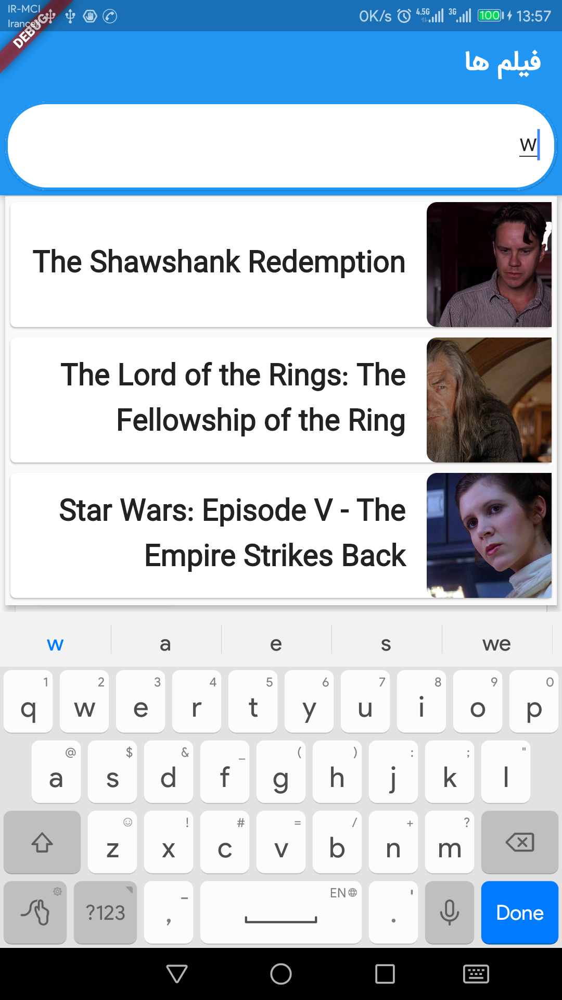
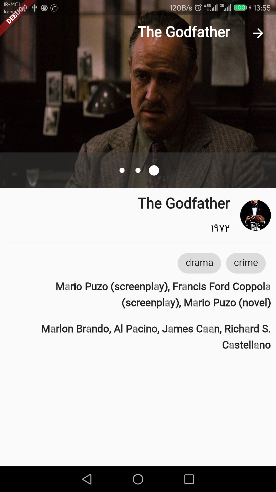
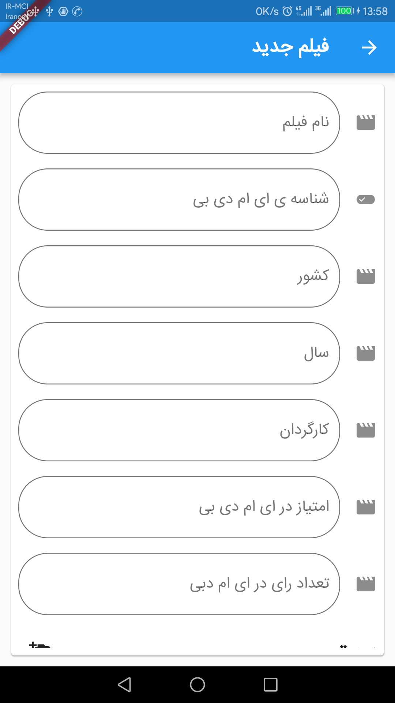

# moviesapi_flutter

http:&#x2F;&#x2F;moviesapi.ir simple client in flutter

#Shots

#Pic1 (Movie list):

#Pic2 (Search):

#Pic3 (Detail):

#Pic4 (New Movie):

For help getting started with Flutter, view our 
[online documentation](https://flutter.io/docs), which offers tutorials, 
samples, guidance on mobile development, and a full API reference.
